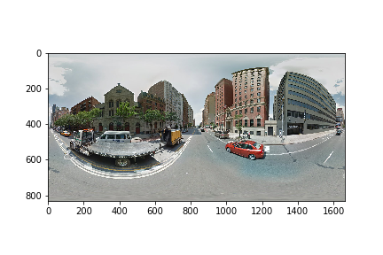

# Google Street View Panorama Image downloader
A python tool to download google street view panorama images with given location. Modified based on [robolyst's work](https://github.com/robolyst/streetview)
### Function added comparing to [original work](https://github.com/robolyst/streetview)
- Faster panorama image retrieve with panoid. Omitting blank blocks and stitching panorama image on the fly.

---

### [Usage](demo.ipynb):
```
import streetview
import matplotlib.pyplot as plt

panoids = streetview.panoids(lat=40.75388056, lon=-73.99697222)
panoid = panoids[0]['panoid']
panorama = streetview.download_panorama_v3(panoid, zoom=2, disp=False)
plt.imshow(panorama)
```
Output:


